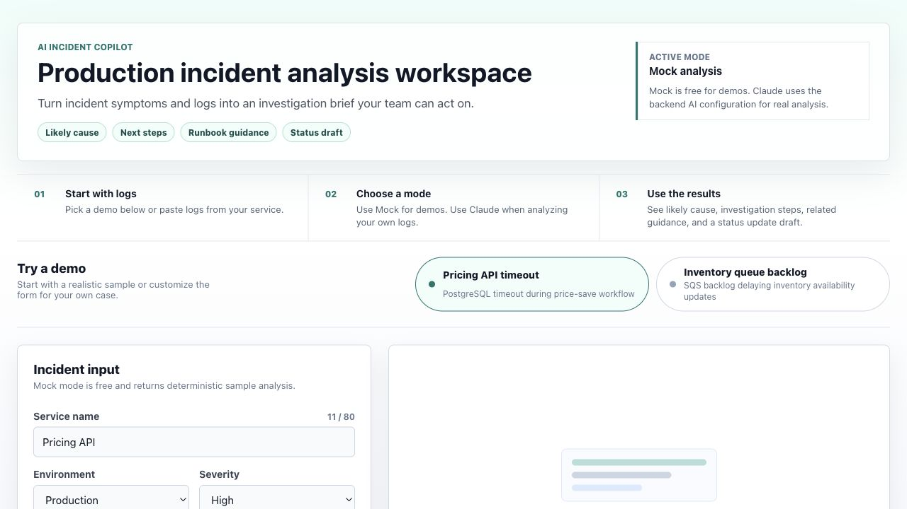
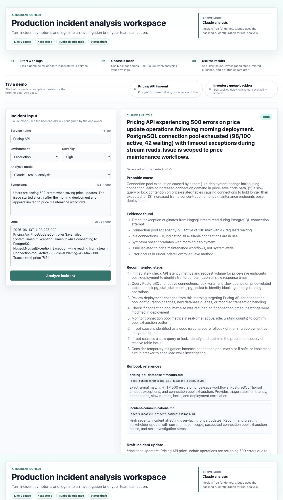

# AI Incident Copilot

Production incident? Paste the symptoms and logs. Get an investigation brief.

AI Incident Copilot is a full-stack AI MVP that helps engineers analyze incidents faster. It turns service symptoms, logs, and generic runbook guidance into a structured response with likely cause, evidence, next steps, and a status update draft.

- No AI cost needed for demos — use Mock mode
- Real Claude analysis available from the .NET backend
- Works with logs from your service, not one specific system
- Built with cost guardrails and backend-only API key handling

## Screenshots

### Incident Workspace



### Claude Analysis Result



## Quick Demo

1. Pick a demo incident or paste logs from your service.
2. Choose Mock mode for a free demo or Claude mode for real AI analysis.
3. Click Analyze incident.
4. Review the generated investigation brief.

## Example Input

```text
Service: Pricing API
Environment: Production
Severity: High

Symptoms:
Users are seeing 500 errors when saving price updates.

Logs:
System.TimeoutException: Timeout while connecting to PostgreSQL
ConnectionPool: Active=98 Idle=0 Waiting=42 Max=100
```

## Example Output

The app returns a structured response:

- Summary
- Probable cause
- Confidence level
- Evidence found in the logs
- Recommended investigation steps
- Related runbook guidance
- Draft incident update

## Features

- React incident intake workspace
- .NET 10 Minimal API backend
- Claude Haiku integration through Anthropic Messages API
- Mock mode for repeatable demos
- Generic runbook guidance for API errors, timeouts, async backlogs, and resource saturation

## Architecture

```text
React + TypeScript UI
        |
        v
.NET 10 Minimal API
        |
        +--> Mock rule-based analyzer
        |
        +--> Claude API analyzer
        |
        +--> Generic runbook context
```

Project layout:

```text
ai-incident-copilot/
  backend/IncidentCopilot.Api/   .NET API and Claude integration
  frontend/                      React + TypeScript UI
  docs/runbooks/                 Generic incident triage guidance
  samples/incidents/             Sample incident payloads
```

## Tech Stack

- Frontend: React, TypeScript, Vite
- Backend: .NET 10 Minimal API
- AI: Claude Haiku via Anthropic API
- Runbooks: Markdown-based generic triage guidance

## Running Locally

Backend:

```bash
cd backend/IncidentCopilot.Api
dotnet run
```

Frontend:

```bash
cd frontend
npm install
npm run dev
```

Claude mode requires backend environment variables:

```bash
export ANTHROPIC_API_KEY="your_real_key_here"
export ANTHROPIC_MODEL="claude-haiku-4-5"
```

Mock mode works without an API key.

## Future Enhancements

- PostgreSQL persistence for saved incidents and analysis history
- RAG over uploaded runbooks and troubleshooting documents
- Vector search for runbook retrieval
- Daily Claude usage limits
- Playwright end-to-end tests
- Public deployment with backend-only secret configuration
- Evaluation cases for known incident scenarios
