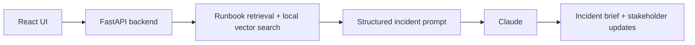

# AI Incident Copilot

AI Incident Copilot helps teams turn incident symptoms and service logs into a clear investigation brief.

The app supports a free mock mode for demos and a Claude-powered mode for real AI analysis. It is designed for production support scenarios where engineers need a quick starting point: likely cause, evidence from logs, next investigation steps, related guidance, and a draft status update.

- Works with logs from your service
- Uses local RAG and vector similarity to retrieve relevant runbook guidance before calling Claude
- Keeps the Claude API key on the backend
- Includes input limits and daily Claude usage controls
- Uses a Python FastAPI backend for AI orchestration

## Live Demo

- Frontend demo: [https://ai-incident-copilot.vercel.app/](https://ai-incident-copilot.vercel.app/)
- Backend health check: [https://ai-incident-copilot-api.onrender.com/](https://ai-incident-copilot-api.onrender.com/)

Note: The backend is hosted on Render's free tier, so the first request may take a short moment if the service has been inactive.

## Quick Demo

1. Pick a sample incident or paste logs from your service.
2. Choose Mock mode for free testing or Claude mode for real AI analysis.
3. Click Analyze incident.
4. Review the likely cause, evidence, checklist, retrieved guidance, and stakeholder updates.

## What Makes It Useful

AI Incident Copilot is not just a chat prompt around Claude. It turns incident analysis into a repeatable workflow:

- Combines symptoms, logs, retrieved runbooks, and optional company notes into one structured request
- Shows which runbook guidance was used, so the answer is easier to trust and review
- Produces consistent outputs: likely cause, evidence, checklist, related guidance, and stakeholder updates
- Supports Mock mode for free demos and Claude mode for real analysis
- Helps teams move from raw logs to an actionable incident plan faster

## Example Input

```text
Service: Pricing API
Environment: Production
Severity: High

Symptoms:
Users are seeing 500 errors when saving price updates.

Logs:
System.TimeoutException: Timeout while connecting to PostgreSQL
ConnectionPool: Active=98 Idle=0 Waiting=42 Max=100
```

## Example Output

The app returns a readable incident brief:

- Summary
- Probable cause
- Confidence level
- Evidence found in the logs
- Interactive investigation checklist
- Related runbook guidance
- Engineering, customer, and executive update drafts

## Features

- Incident input form for service name, environment, severity, symptoms, and logs
- Optional company runbook notes field for team-specific troubleshooting guidance
- Mock mode for free repeatable demos
- Claude mode for real AI analysis
- Local RAG retrieval with visible retrieved guidance in the UI
- Markdown, text, and PDF runbook upload with backend chunking and local vector similarity search
- Role-specific stakeholder updates for engineering, customer, and executive audiences
- Backend-only API key handling
- Daily Claude usage limit for cost control
- Friendly error messages when Claude is unavailable or usage limits are reached
- Runbook coverage for API errors, async backlogs, resource saturation, deployments, rollbacks, and database incidents

## How It Works



```text
User enters symptoms and logs
        |
        v
FastAPI validates and controls the request
        |
        +--> Retrieves the most relevant runbook snippets and uploaded runbook excerpts
        |
        +--> Adds optional company runbook notes from the user
        |
        +--> Adds the Incident Communications Template
        |
        +--> Uses Mock mode or Claude mode
        |
        v
App displays a consistent investigation brief
```

Instead of sending raw logs directly to Claude, the FastAPI backend validates the request, retrieves relevant runbook guidance, builds a structured incident prompt, and calls Claude. This keeps the workflow repeatable and helps produce a consistent response with likely cause, evidence, next steps, related guidance, and a stakeholder-ready update draft.

## RAG Flow

AI Incident Copilot supports uploaded runbook guidance with a local vector-search workflow:

1. User uploads a Markdown, text, or PDF runbook.
2. The FastAPI backend extracts readable text from the document.
3. The backend chunks the document into focused excerpts.
4. Each chunk is converted into a local sparse embedding.
5. When an incident is submitted, the backend embeds the incident query.
6. The app retrieves the most similar uploaded runbook chunks.
7. Claude receives the incident details plus retrieved guidance to generate the response.

This grounds the analysis in runbook context instead of relying only on a raw prompt.

Project layout:

```text
ai-incident-copilot/
  ai-service/                    Python FastAPI backend and AI orchestration
  frontend/                      React + TypeScript UI
  docs/runbooks/                 Human-readable runbook source files
  ai-service/app/runbooks/       Packaged runbooks used by the RAG retriever
  samples/incidents/             Sample incident payloads
```

## Built With

- Frontend: React, TypeScript, Vite
- Backend: Python, FastAPI
- AI: Claude Haiku via Anthropic API
- RAG: Built-in runbook retrieval plus local vector similarity search for uploaded runbooks

## Running Locally

Backend:

```bash
cd ai-service
python3 -m venv .venv
source .venv/bin/activate
pip install -r requirements.txt
export ANTHROPIC_API_KEY="your_real_key_here"
export ANTHROPIC_MODEL="claude-haiku-4-5"
export ALLOWED_ORIGINS="http://localhost:5173"
export CLAUDE_DAILY_LIMIT="5"
uvicorn app.main:app --reload --port 8000
```

Frontend:

```bash
cd frontend
npm install
npm run dev
```

Frontend API URL:

```bash
VITE_API_BASE_URL=http://localhost:8000
```

Mock mode works without an API key.

## Retrieval Evaluations

Run the retrieval evals to verify known incidents retrieve the expected guidance:

```bash
cd ai-service
source .venv/bin/activate
pytest evals
```

The evals cover pricing timeouts, inventory backlog, checkout release regression, uploaded runbook vector retrieval, and runbooks that should not be retrieved.

## Cost And Safety

- Mock mode is free and does not call Claude.
- Claude mode must be selected manually.
- API keys stay in the backend and are never exposed to the React app.
- Claude mode is limited by `CLAUDE_DAILY_LIMIT`.
- Input length limits are enforced in both the UI and backend.

## Deployment Notes

- Frontend is deployed on Vercel.
- FastAPI backend is deployed on Render.
- Claude API keys are stored only as backend environment variables.
- The frontend calls the backend through `VITE_API_BASE_URL`.

Backend environment variables:

```text
ANTHROPIC_API_KEY=your_real_key_here
ANTHROPIC_MODEL=claude-haiku-4-5
ALLOWED_ORIGINS=http://localhost:5173,https://ai-incident-copilot.vercel.app
CLAUDE_DAILY_LIMIT=5
```

Frontend environment variable:

```text
VITE_API_BASE_URL=https://your-fastapi-backend.onrender.com
```

Render backend settings:

```text
Root Directory: ai-service
Environment: Docker
Dockerfile Path: Dockerfile
```

## Future Enhancements

- Save incident history and analysis results with PostgreSQL
- Add Playwright end-to-end tests
- Persist uploaded runbook embeddings with PostgreSQL + pgvector

## License

MIT License. See [LICENSE](LICENSE).
